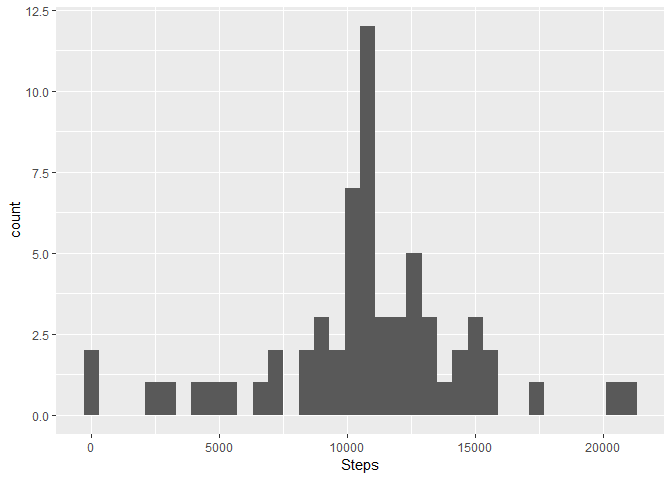

## Loading and preprocessing the data

To start the analysis, first we need some data:


```r
MyData <- read.csv("activity.csv")
```


## What is mean total number of steps taken per day?

In this part, we ignore the NA values. 
To start, we need to calculate the total number of steps taken per day:


```r
library(dplyr)
```

```
## 
## Attaching package: 'dplyr'
```

```
## The following objects are masked from 'package:stats':
## 
##     filter, lag
```

```
## The following objects are masked from 'package:base':
## 
##     intersect, setdiff, setequal, union
```

```r
StepsPerDay <- MyData %>%
  group_by(date) %>%
  summarize(Steps=sum(steps))
```

Now we can make a histogram of the total steps per day:


```r
library(ggplot2)
```

```
## Warning: package 'ggplot2' was built under R version 3.5.3
```

```r
ggplot(subset(StepsPerDay,!is.na(Steps)), aes(x=Steps)) + geom_histogram(binwidth = 600)
```

<!-- -->

We also calculate the mean and median of the total number of steps taken per day:


```r
mean(StepsPerDay$Steps, na.rm = TRUE)
```

```
## [1] 10766.19
```

```r
median(StepsPerDay$Steps, na.rm = TRUE)
```

```
## [1] 10765
```

## What is the average daily activity pattern?

First we average the number of steps taken per 5 minute interval across all days:


```r
AvgStepsPerInterval <- MyData %>%
  group_by(interval) %>%
  summarize(Steps=mean(steps, na.rm = TRUE))
```

Then we make a time series plot of the 5-minute interval and the average number of steps taken, averaged across all days:


```r
ggplot(data=AvgStepsPerInterval, aes(x=interval, y=Steps)) +
  geom_line()
```

<!-- -->

The 5-minute interval with that contains the maximum number of steps on average across all the days is 835.

## Imputing missing values

The total number of missing values is 2304.
A new dataset is created where the missing values are imputed by the average of that period, which we calculated earlier:


```r
for (i in 1:nrow(MyData)){
  if (is.na(MyData$steps[i])){
    MyData$steps[i]=AvgStepsPerInterval$Steps[which(AvgStepsPerInterval$interval == MyData$interval[i])]
  }
}
```

Now we repeat the first analysis we did with this new dataset.
First, we calculate the total number of steps taken per day:


```r
library(dplyr)
StepsPerDay <- MyData %>%
  group_by(date) %>%
  summarize(Steps=sum(steps))
```

Now we can make a histogram of the total steps per day:


```r
ggplot(StepsPerDay, aes(x=Steps)) + geom_histogram(binwidth = 600)
```

<!-- -->

We also calculate the mean and median of the total number of steps taken per day:


```r
mean(StepsPerDay$Steps)
```

```
## [1] 10766.19
```

```r
median(StepsPerDay$Steps)
```

```
## [1] 10766.19
```

## Are there differences in activity patterns between weekdays and weekends?

First we create a new factor variable with two levels: weekday and weekend.


```r
for (i in 1:nrow(MyData)){
  if (weekdays(as.Date(MyData$date[i]))=="zaterdag"|weekdays(as.Date(MyData$date[i]))=="zondag"){
    MyData$weekday[i]=1
  }
  else {
    MyData$weekday[i]=0
  }
}
```

Now we compare the average steps per 5-minute time interval across week- and weekend days.
First we average the number of steps taken per 5 minute interval across week- and weekend days:


```r
AvgStepsPerInterval <- MyData %>%
  group_by(interval, weekday) %>%
  summarize(Steps=mean(steps, na.rm = TRUE))
```

Then we make a time series plot of the 5-minute interval and the average number of steps taken, averaged across all week- and weekend days:


```r
ggplot(data=AvgStepsPerInterval, aes(x=interval, y=Steps)) +
  geom_line()+facet_grid(rows=vars(weekday))
```

<!-- -->
